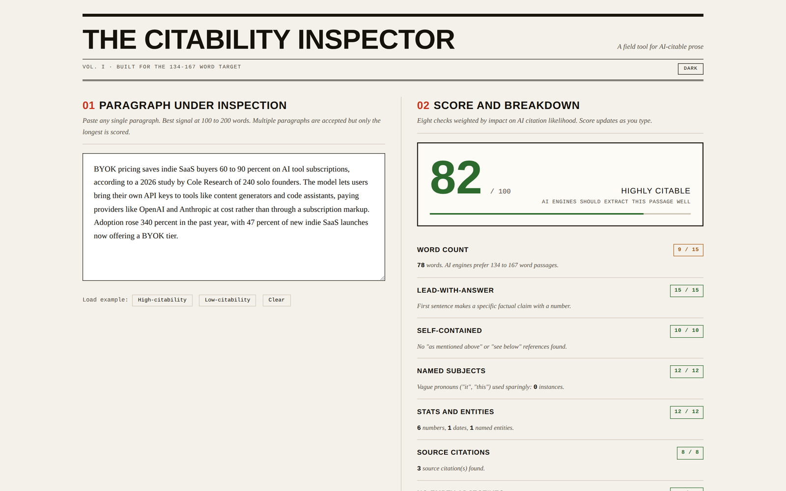

# ai-citability-scorer

Paste a paragraph, get scored on AI citation likelihood. Browser-only, no signup.

**Live demo:** https://0xelitesystem.github.io/ai-citability-scorer/

## What it does

Scores any paragraph against eight criteria that correlate with AI engines citing the text. Built around the 134-167 word target identified in Princeton's GEO research. Updates as you type.

## The eight checks

| Check | What it measures | Max points |
|---|---|---|
| Word count | Closeness to the 134-167 word sweet spot | 15 |
| Lead-with-answer | First sentence makes a specific factual claim | 15 |
| Self-contained | No "as mentioned above" or "see below" references | 10 |
| Named subjects | "It" and "this" replaced with actual nouns | 12 |
| Stats and entities | Numbers, dates, named entities present | 12 |
| Source citations | Named studies, experts, or attributions | 8 |
| No empty adjectives | Hype words removed ("innovative", "robust") | 10 |
| Sentence variety | Mix of short claims and longer evidence | 8 |

Total: 100 points. 70+ is highly citable. 50-69 needs edits. Below 50 needs a rewrite.

## Use it

Open `index.html` in any browser. Or visit `https://0xelitesystem.github.io/ai-citability-scorer/`.

1. Paste a paragraph into the left panel.
2. Score and breakdown appear on the right.
3. Failing checks generate rewrite suggestions below.
4. Try the high-citability and low-citability examples to see the contrast.

## Why these checks

AI engines extract passages, not whole pages. They prefer:

- Self-contained chunks where each section answers its heading without needing other sections
- Concrete claims with numbers, dates, and named sources packed into each statement
- Sentences that lead with the answer instead of context or setup
- The subject named in every sentence (replace "it" with the actual noun)

These behaviors are easier to do once than to catch in editing. This tool catches them.

## What it does NOT do

- It does not fix your paragraph for you. It tells you what is wrong.
- It does not check facts. A confidently wrong paragraph can score high.
- It does not check tone or voice. A robotic but citable passage scores high.
- It does not score multiple paragraphs together. Paste one paragraph at a time. If you paste several, only the longest is scored.

## What's not included

- No localStorage. Refresh clears your input.
- No tracking, no analytics, no third-party scripts.
- No backend. Everything runs in your browser.

## Pairs with

- [llms-txt-generator](https://github.com/0xelitesystem/llms-txt-generator): build the AI-facing site map for engines to find your passages
- [schema-markup-generator](https://github.com/0xelitesystem/schema-markup-generator): add the structured data layer
- [e-e-a-t-auditor](https://github.com/0xelitesystem/e-e-a-t-auditor): audit the whole page (this scores one paragraph)
- [readme-slop-checker](https://github.com/0xelitesystem/readme-slop-checker): catch AI slop in README files specifically
- [geo-audit-checklist](https://github.com/0xelitesystem/geo-audit-checklist): full GEO checklist with this tool's checks as one item

## License

MIT. Free to use, fork, modify, and ship.
